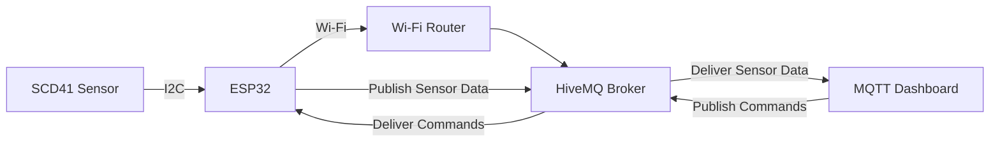

# Project Architecture

This document describes the architecture of the ESP32 MQTT Greenhouse Monitoring System.

---

# System Overview

The project is designed around an ESP32 microcontroller that collects environmental data from an SCD41 sensor and communicates with an MQTT broker over Wi-Fi.

The MQTT broker acts as the communication bridge between the ESP32 and the MQTT client.

---

# Architecture Diagram



---

# System Components

## ESP32

The ESP32 is the main controller of the project.

Responsibilities:

- Connects to the Wi-Fi network.
- Connects to the MQTT broker.
- Reads sensor values.
- Creates JSON payloads.
- Publishes sensor data.
- Receives MQTT commands.
- Controls the onboard LED.

---

## SCD41 Sensor

The Sensirion SCD41 sensor communicates with the ESP32 using the I2C protocol.

Measured Parameters:

- CO₂ Concentration (ppm)
- Temperature (°C)
- Relative Humidity (%)

---

## Wi-Fi Network

The Wi-Fi router provides Internet connectivity for the ESP32.

Responsibilities:

- Connects the ESP32 to the Internet.
- Enables communication with the MQTT broker.

---

## MQTT Broker

The project uses the public HiveMQ MQTT broker.

Responsibilities:

- Receives published sensor data.
- Stores no application logic.
- Delivers messages to subscribed clients.
- Routes commands from the MQTT client to the ESP32.

---

## MQTT Client

The MQTT client (Dashboard or MQTT Explorer) is used to:

- View live sensor data.
- Publish commands.
- Monitor MQTT topics.
- Test the IoT application.

---

# Data Flow

The overall communication sequence is:

1. ESP32 reads data from the SCD41 sensor.
2. Sensor data is converted into JSON format.
3. The JSON payload is published to the HiveMQ broker.
4. The MQTT client subscribes to the data topic and displays the received values.
5. The user publishes a command to the command topic.
6. The MQTT broker forwards the command to the ESP32.
7. The ESP32 executes the callback function.
8. The LED blinks according to the received command.

---

# Communication Protocols

| Communication | Protocol |
|--------------|----------|
| ESP32 ↔ SCD41 | I2C |
| ESP32 ↔ Wi-Fi Router | IEEE 802.11 Wi-Fi |
| ESP32 ↔ HiveMQ Broker | MQTT |
| MQTT Payload | JSON |

---

# Publish and Subscribe Topics

## Publish

```text
manav/greenhouse/data
```

Contains:

- Temperature
- Humidity
- CO₂ Concentration

---

## Subscribe

```text
greenhouse/command
```

Supported command:

```text
blink led
```

---

# Project Architecture Summary

The ESP32 acts as the central controller of the system. It periodically collects environmental data from the SCD41 sensor through the I2C interface. After processing the measurements, the ESP32 formats the data into a JSON object and publishes it to the HiveMQ MQTT broker using the Wi-Fi network.

At the same time, the ESP32 subscribes to a command topic, allowing an MQTT client to remotely control the device by sending predefined commands such as **blink led**. This architecture enables real-time monitoring and remote control, making the system suitable for IoT-based greenhouse monitoring applications.