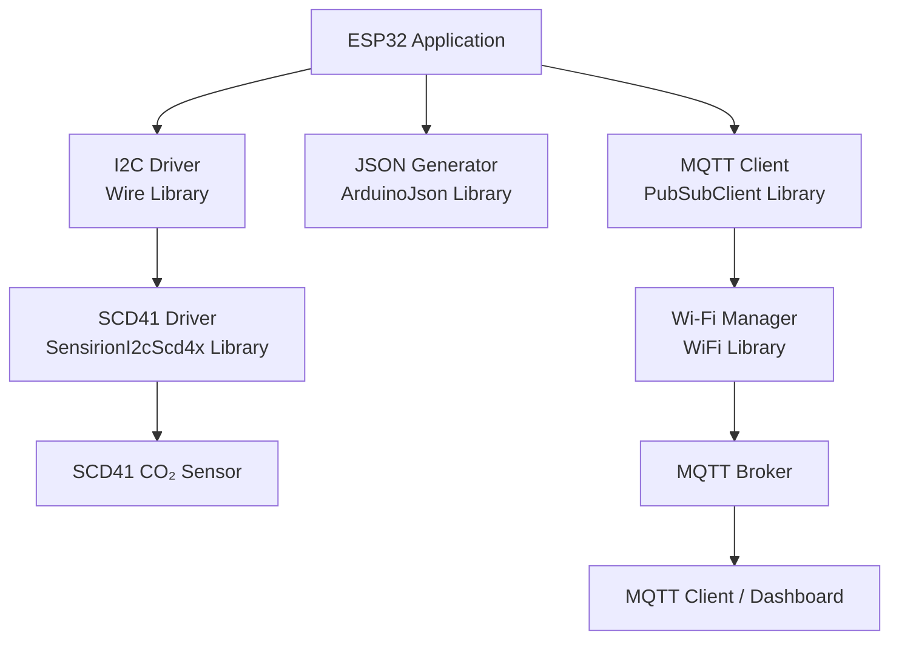

# Component Architechture

```mermaid
flowchart TD

 A[ESP32 Application]

    B[MQTT Client<br>PubSubClient Library]

    C[Wi-Fi Manager<br>WiFi Library]

    D[JSON Generator<br>ArduinoJson Library]

    E[I2C Driver<br>Wire Library]

    F[SCD41 Driver<br>SensirionI2cScd4x Library]

    G[SCD41 CO₂ Sensor]

    H[MQTT Broker]

    I[MQTT Client / Dashboard]


     A --> B
    A --> D
    A --> E

    B --> C
    C --> H

    H --> I

    E --> F
    F --> G
```