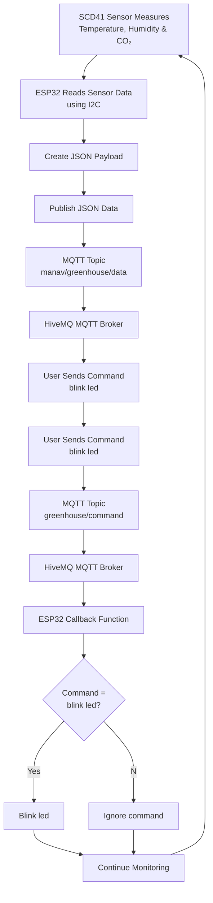

# MQTT Workflow

```mermaid
flowchart TD

A[SCD41 Sensor Measures<br/>Temperature, Humidity & CO₂]--> B[ESP32 Reads Sensor Data<br/>using I2C]

B--> C[Create JSON Payload]

C--> D[Publish JSON Data]

D--> E[MQTT Topic<br/>manav/greenhouse/data]

E--> F[HiveMQ MQTT Broker]

F--> G[User Sends Command<br/>blink led]

G--> H[User Sends Command<br/>blink led]

H--> I[MQTT Topic<br/>greenhouse/command]

I--> J[HiveMQ MQTT Broker]

J--> K[ESP32 Callback Function]

K--> L{Command =<br/>blink led?}

L--Yes--> M[Blink led]

L--No-->N[Ignore command]

M--> O[Continue Monitoring]

N--> O

O--> A
```