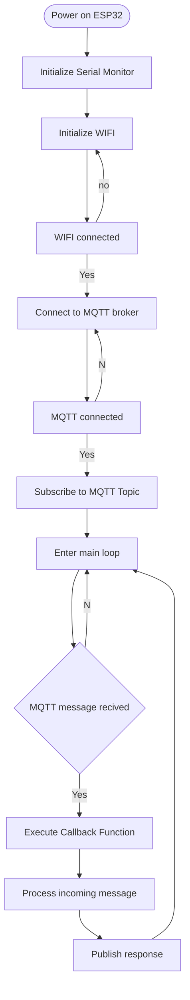

# ESP32 MQTT Project Flowchart

```mermaid
flowchart TD

A([Power on ESP32]) --> B[Initialize Serial Monitor]

B --> C[Initialize WIFI]

C --> D[WIFI connected]

D --noo--> C
D --Yes--> E[Connect to MQTT broker ]

E --> F[MQTT connected]

F --No--> E
F --Yes--> G[Subscribe to MQTT Topic]

G --> H[Enter main loop]

H --> I{MQTT message recived}

I --No--> H
I --Yes--> J[Execute Callback Function]

J --> K[Process incoming message]

K --> L[Publish response]

L --> H
```
