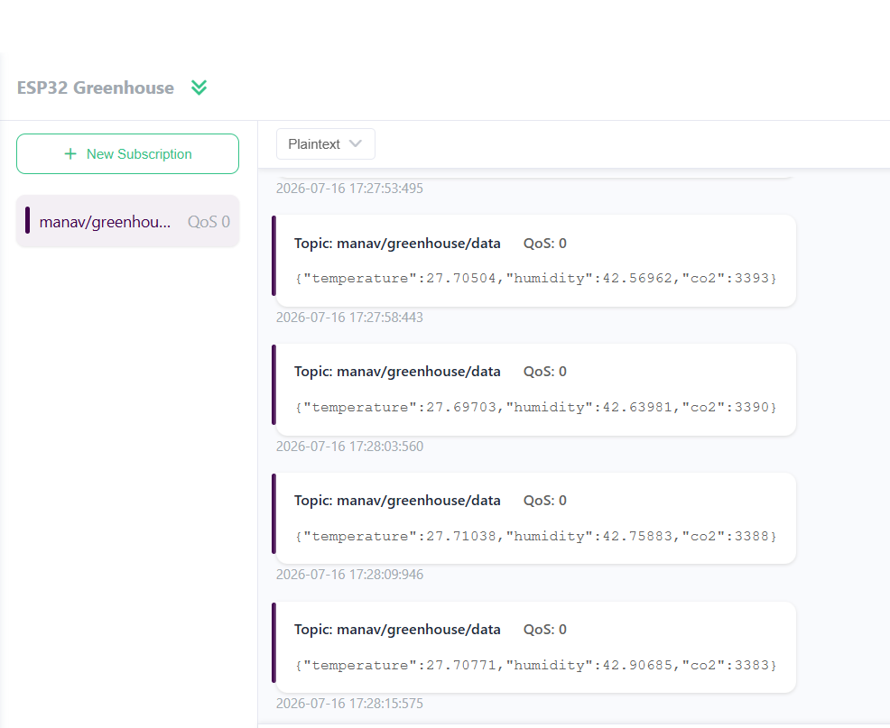
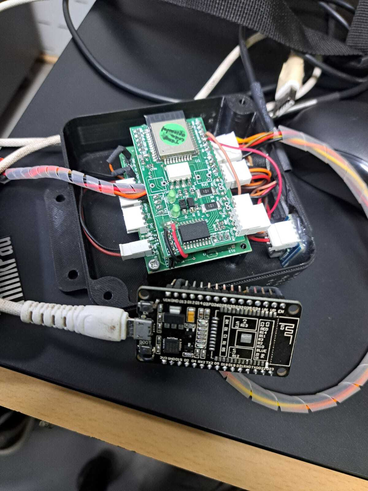

# ESP32 MQTT communication 

## Project Description 

this projects uses an ESP32 microcontroller and a SCD41 sensor to measure CO2, Temprature and Humidity and for communication it uses MQTT Protocol along with JSON for data handling

## Features 

- ESP32 is connected to a WIFI
- Real time Monitoring of the surrounding 
- 2 way MQTT protocol has been used 
- Real time Dashboard to display the result 

## Hardware used

- ESP32 Devlopment Board 
- SCD41 Sensor 
- Laptop/Computer
- Data/Power Cable 

## Software used 

- Arduino ide
- GIT
- Visual studio code 

## Libraries Used

- `WIFI.h`
- `PubSubClient.h`
- `ArduinoJson.h`
- `SensirionI2cScd4x.h`
- `Wire.h`

## Project Structure

```text
ESP32-MQTT-Project_Manav
│
├── .gitignore
├── README.md
├── sketch_jul15c_MQTT.ino
│
├── Images
│   ├── MQTT_Dashboard.PNG
│   ├── Hardware_Setup.jpg
│   └── ...
│
├── diagrams
│   ├── ESP32_MQTT_Project_Flowchart.md
│   ├── System_Architecture.md
│   └── Component_Architecture.md
│
└── docs
    ├── Code_Explanation.md
    ├── MQTT_Topics.md
    ├── Project_Architecture.md
    └── Installation_Guide.md
```
```
## How it Works 

- The ESP32 connects to a wifi 
- The Sensors pushes the values to ESP32
- USing MQTT protocol The data is send to the broker where the subscriber can get acces
- The subscriber can also push Commands on the Dashboard to the ESP32 to Blink the LED

## How to Run

1. Install Arduino IDE.
2. Install the ESP32 Board Package.
3. Install the required libraries.
4. Update the Wi-Fi credentials.
5. Update the MQTT broker details.
6. Upload the code to the ESP32.
7. Open the Serial Monitor to observe communication.

## Future Improvements

- Add JSON support
- Add OTA firmware updates
- Integrate sensors
- Improve error handling
- Add multiple MQTT topics

## Project Images 

### Serial Monitor Output 



### Hardware Setup



## Author 

**Manav Daga**

Embedded system Enginner