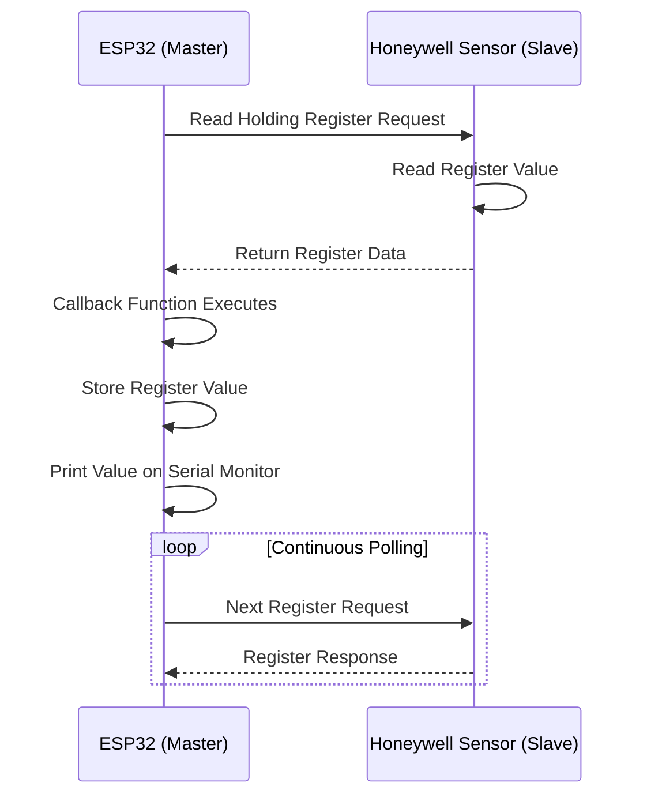

## Modbus RTU Communication Sequence

```mermaid
sequenceDiagram

participant ESP32 as ESP32 (Master)
participant Honeywell as Honeywell Sensor (Slave)

ESP32->>Honeywell: Read Holding Register Request
Honeywell->>Honeywell: Read Register Value
Honeywell-->>ESP32: Return Register Data
ESP32->>ESP32: Callback Function Executes
ESP32->>ESP32: Store Register Value
ESP32->>ESP32: Print Value on Serial Monitor

loop Continuous Polling
ESP32->>Honeywell: Next Register Request
Honeywell-->>ESP32: Register Response
end
```